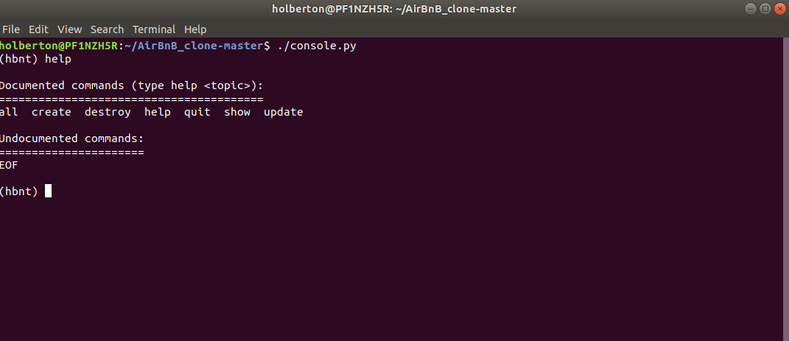
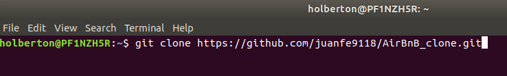
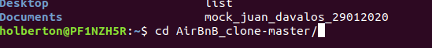
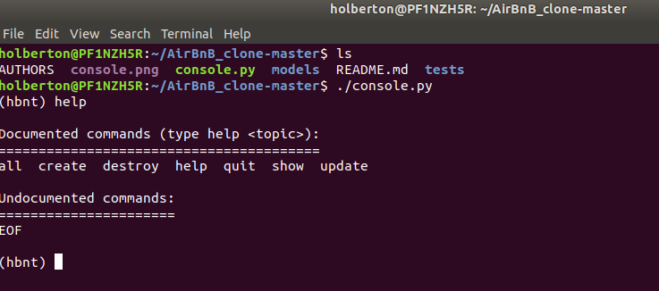
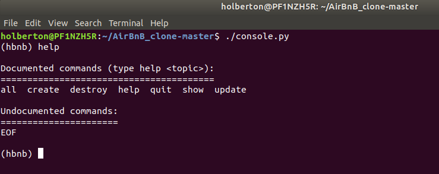
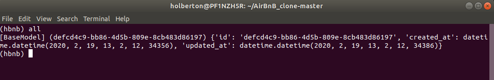
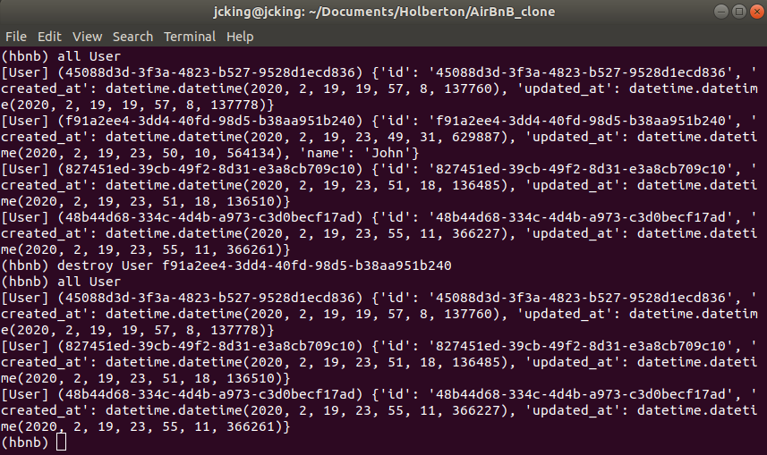
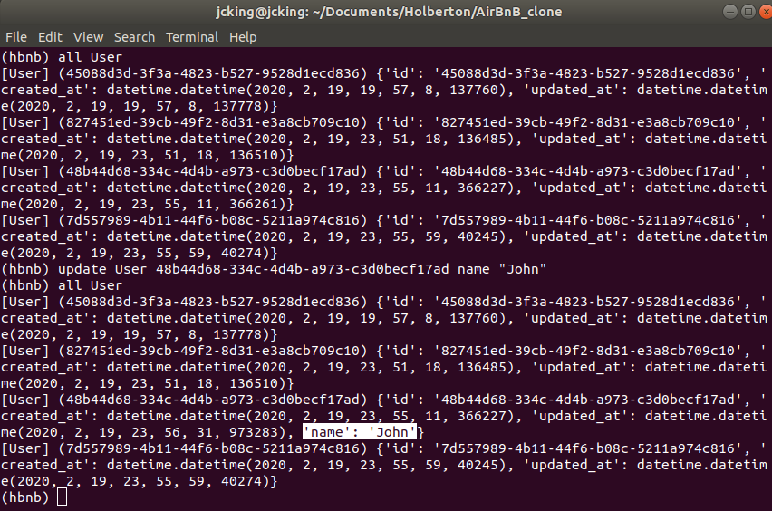
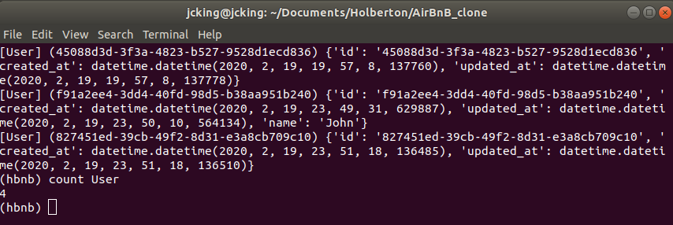

# AirBnB_clone
[**Airbnb**](https://www.airbnb.com/). is an online marketplace for arranging or offering lodging, primarily homestays, or tourism experiences. The company does not own any of the real estate listings, nor does it host events; it acts as a broker, receiving commissions from each booking.

The goal of the project is to deploy on our own server a simple copy of the [**AirBnB website**]((https://www.airbnb.com/)).

## Description of the project
We don’t implement all the features, only some of them to cover all fundamental concepts of the higher level programming track at [**Holberton**](https://www.holbertonschool.com/).

This project will be a complete a full web application composed by:

+ A command interpreter to manipulate data without a visual interface, like in a Shell (_perfect for development and debugging_).
+ A website (_the front-end_) that shows the final product to everybody: **static and dynamic**.
+ A database or files that store data (**data = objects**).
+ An API that provides a communication interface between the front-end and your data (_retrieve, create, delete, update them_).

The firs part of the whole project is: **AirBnB clone - The console**

## AirBnB clone - The console

This is the first part of this project, it represents the data model.

The purpose of this model is to:

+ Build the data model.
+ Perform operations like (_create, update, destroy, etc_) in the objects via a console.
+ Build a powerfull storage system, that will be capable of storing and loading objects to and from a file (**[JSON file](https://www.json.org/)**).

## How to start using it
First of all, to use our application you have to clone our repository using the command on your terminal:

`git clone https://github.com/juanfe9118/AirBnB_clone.git`

Once this is done, a folder named **AirBnB_clone-master** is created, you have to go inside it, using de command `cd` on your terminal.

`cd AirBnB_clone-master`

Once you're inside of the AirBnB_clone-master folder, you have to execute the console with the command:

`./console.py`

Done this, it will show the console of our application, from here, we can interact with the application data.

## Examples
Now we are going to show some of the application features.

### help command
This command shows us the help for the most common actions on the console.

On the console type: `help`

### create
Creates an instances of a class, usage: `create <ClassName>` 

It can also be used as follows: `<ClassName>.create`

### all
Shows all created instances, usage: `all (OPTIONAL)<ClassName>`

It can also be used like this: `<ClassName>.all`

### show
Shows info about a created instance of a class using id as parameter, usage: `show <ClassName> id`

It can also be used al follows: `<ClassName>.show("id")` _id must be in parenthesis and quoted_

### destroy
Destroys a created instance of a class using id as parameter, usage: `destroy <ClassName> id`

It can also be used as follows: `<ClassName>.destroy("id")` _id must be in parenthesis and quoted_

### update
Updates a created instance of a class using id as parameter as well as the attribute name and the value, usage: `update <ClassName> <attribute name> '<attribute value>'`

It can also be used as follows: `<ClassName>.update("id", "attribute name", "attribute value")`

### count
Counts the number of instances of a class: usage: `count <ClassName>`

It can also be used like this: `<ClassName>.count`

## AUTHORS
---
- [Victor Arteaga](https://twitter.com/Xathovic)
- [Juan Felipe Buitrago](https://twitter.com/juanfe9118)
- [Jackson Moreno](https://twitter.com/jaarmore)

---

